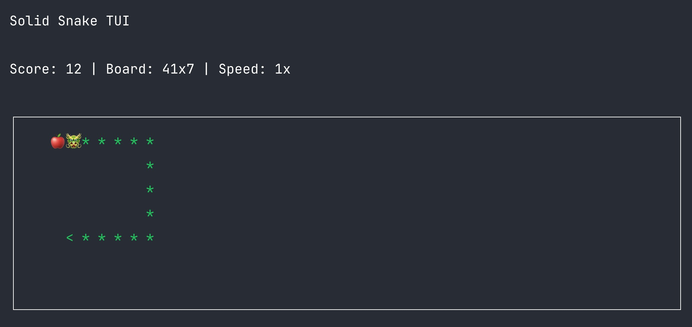

# Solid Snake TUI

Snake for the terminal, built with Bun, OpenTUI, and Solid.



## Requirements

- [Bun](https://bun.sh/)

## Run with `bunx`

Play immediately without installing globally:

```bash
bunx solid-snake-tui
```

## Install globally

If you want a persistent command:

```bash
bun add -g solid-snake-tui
solid-snake-tui
```

## Local development

Install dependencies:

```bash
bun install
```

Run in watch mode:

```bash
bun dev
```

Run once:

```bash
bun start
```

## Controls

- `Arrow keys` or `WASD`: move
- `Press the same direction again`: boost to `2x`
- `Space` or `P`: pause
- `R`: restart
- `Esc`: quit

## Gameplay

- The snake wraps around on all sides of the board.
- The board size adapts to the terminal size.
- If the terminal is resized, the game resets completely.

## Tech

- [Bun](https://bun.sh/)
- [OpenTUI](https://opentui.com/)
- [Solid](https://www.solidjs.com/)
